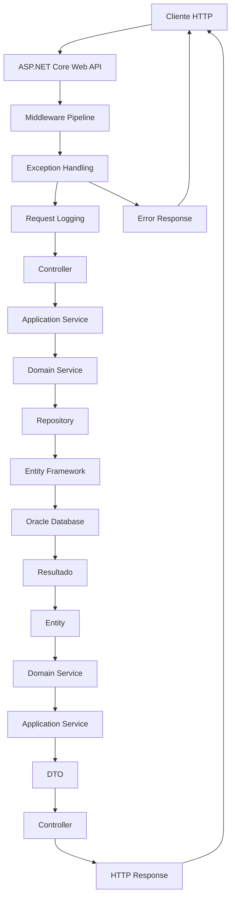
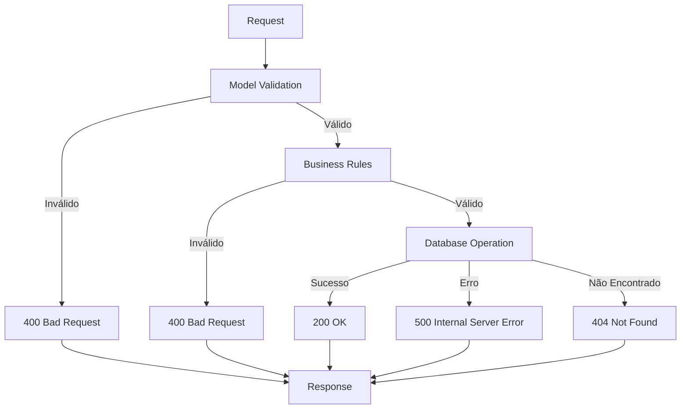
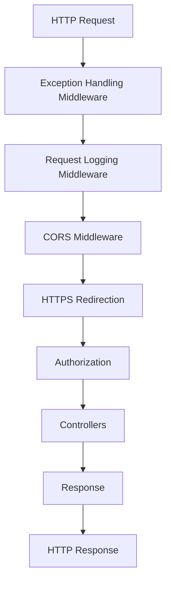
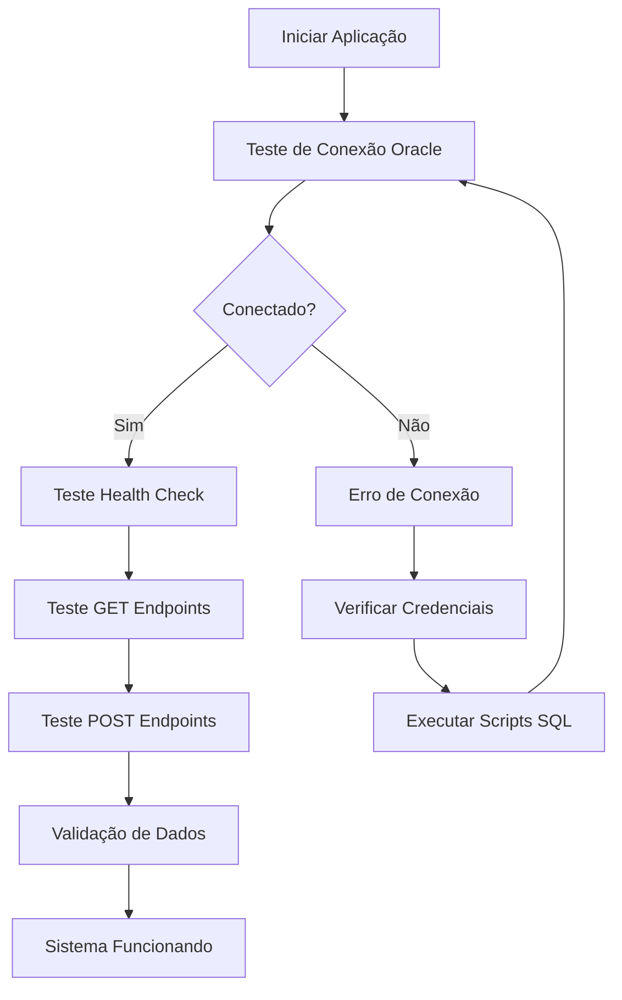
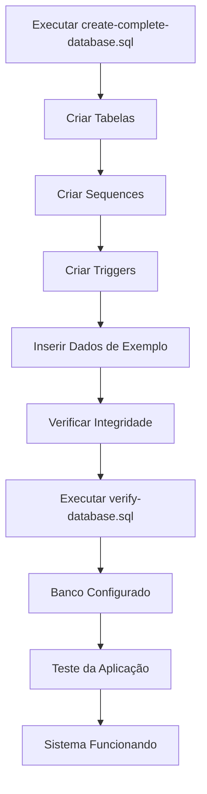

# Diagrama de Fluxo da API - Sistema Contábil

## Fluxo de Requisições HTTP



## Endpoints da API

```mermaid
graph LR
    subgraph "Centro de Custo"
        CC1[GET /api/CentroCusto]
        CC2[GET /api/CentroCusto/{id}]
        CC3[POST /api/CentroCusto]
        CC4[PUT /api/CentroCusto/{id}]
        CC5[DELETE /api/CentroCusto/{id}]
    end
    
    subgraph "Conta"
        C1[GET /api/Conta]
        C2[GET /api/Conta/{id}]
        C3[POST /api/Conta]
        C4[PUT /api/Conta/{id}]
        C5[DELETE /api/Conta/{id}]
    end
    
    subgraph "Registro Contábil"
        R1[GET /api/RegistroContabil]
        R2[GET /api/RegistroContabil/{id}]
        R3[POST /api/RegistroContabil]
        R4[PUT /api/RegistroContabil/{id}]
        R5[DELETE /api/RegistroContabil/{id}]
    end
    
    subgraph "Health Check"
        H1[GET /health]
    end
    
    subgraph "Teste de Conexão"
        T1[GET /api/Test/connection]
        T2[GET /api/Test/connections]
    end
    
    subgraph "Swagger"
        S1[GET /swagger]
        S2[GET /swagger/v1/swagger.json]
    end
```

## Fluxo de Validação



## Middleware Pipeline



## Fluxo de Teste da Aplicação



## Fluxo de Configuração do Banco


