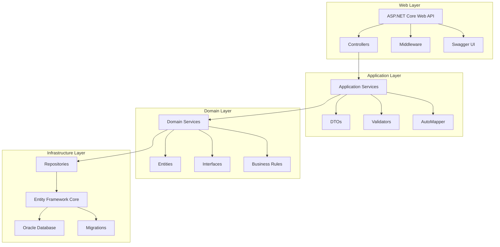
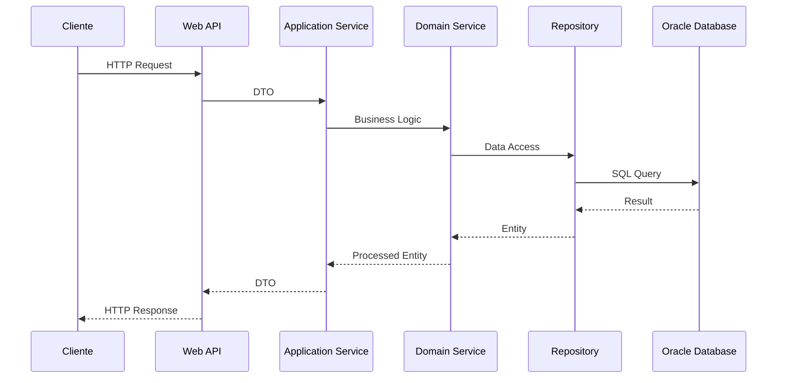
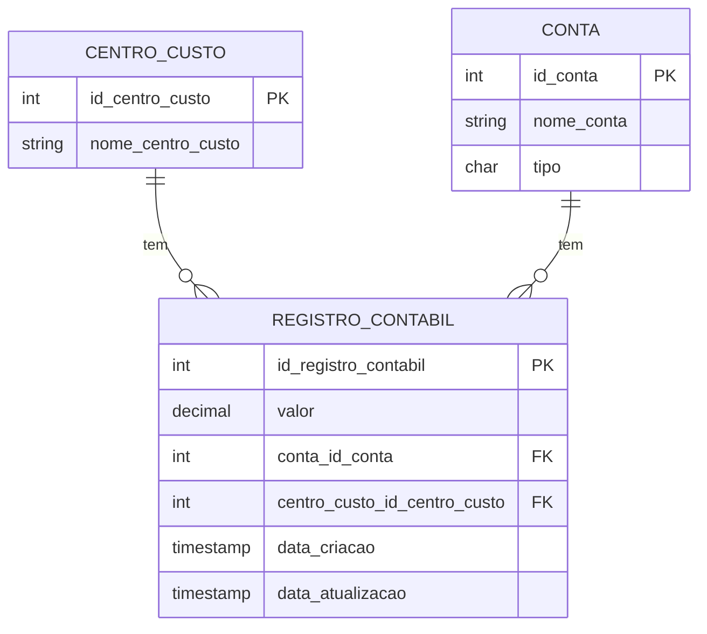
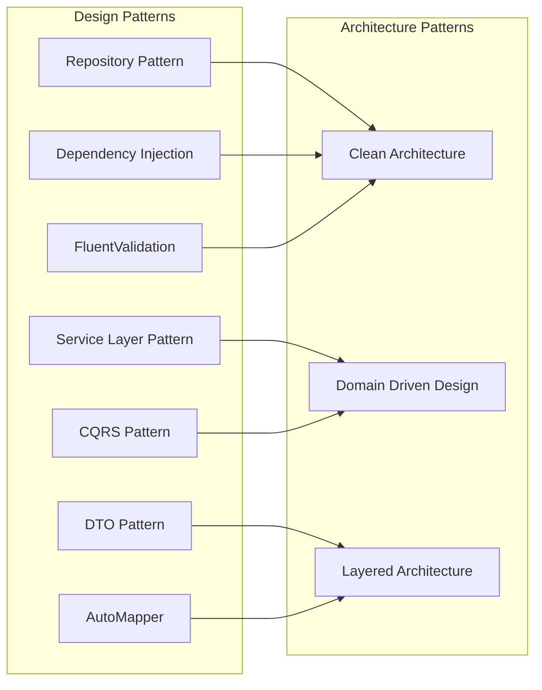
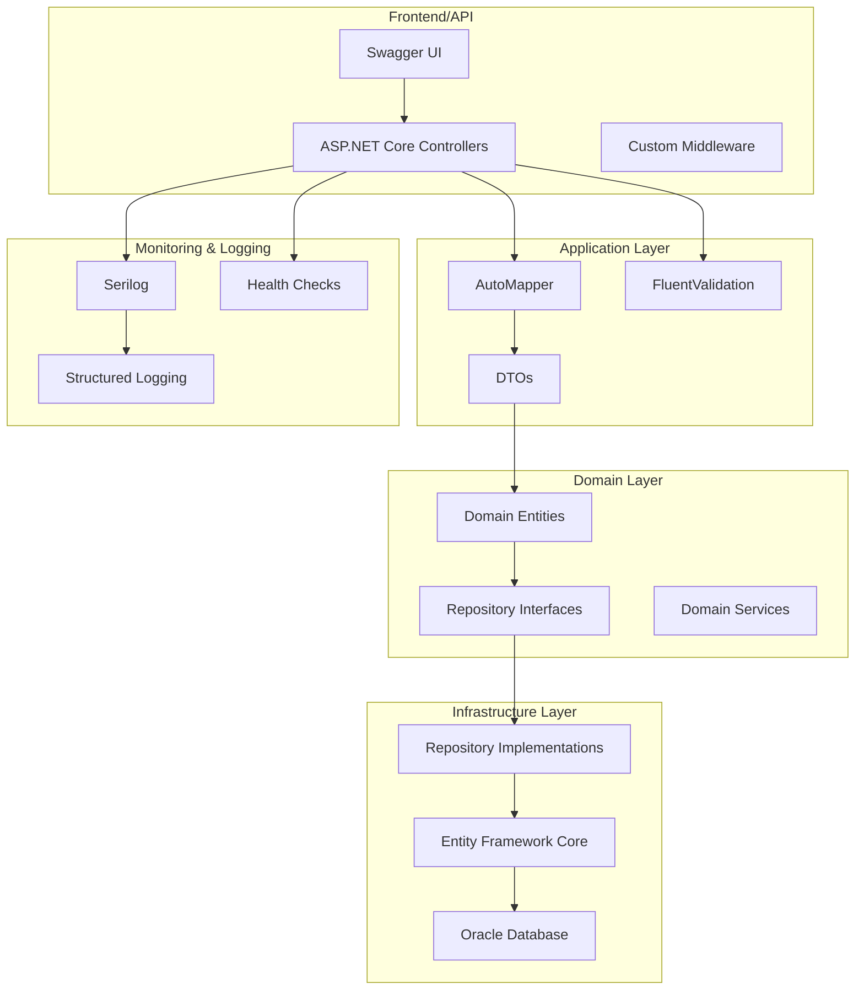

# Diagrama de Arquitetura - Sistema Contábil

## Arquitetura em Camadas (Clean Architecture)

## Fluxo de Dados

## Modelo de Dados

## Padrões de Design Utilizados

## Tecnologias e Ferramentas

